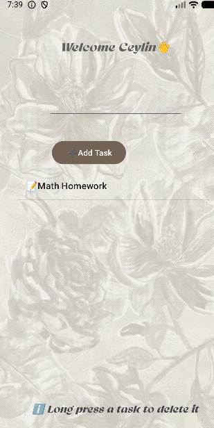

# 📋 Todo App
A simple Android To-Do List application developed with Java in Android Studio.

## Features

- ✅ Add tasks
- ✅ Delete tasks
- ✅ Simple and user-friendly interface

## Technologies
- Java
- Android Studio

## 📂 Project Structure
- Java source code
- XML layouts
- Gradle build files
- Android project structure

### Home Screen

## Screenshots
### Add Task 

## Author
Ceylin KALE
